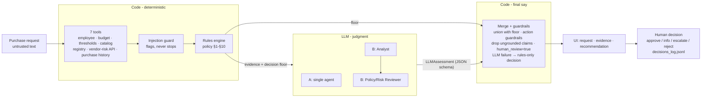

# Architecture & Workflow

## Design principle

| Layer | Owns | Never does |
|---|---|---|
| **Code** | Evidence retrieval, thresholds, budget, review-date maths, every policy rule that can be written as an `if`, final merge | Judge whether a justification is a credible gap |
| **AI** | Overlap / credible-gap judgment, AI data-class fit, choosing the next action, writing the recommendation | Remove an approval or flag, compute thresholds, call tools, approve anything |
| **Human** | Every approval, exception and override | - |

## Workflow

Both architectures share every box except the LLM step, so the evaluation isolates the effect of the agent topology.

## Tools

| Tool | Source | Type | Failure behaviour |
|---|---|---|---|
| `lookup_employee` | employees.csv | data | unknown requester → missing information |
| `check_budget` | department_budgets.csv | **deterministic** | missing cost/department → `cannot_check` |
| `approval_thresholds` | policy §4 table | **deterministic** | missing cost → tier `undetermined` (never assumes lowest tier) |
| `search_catalog` | software_catalog.csv | data | match types: same_category / same_product / same_vendor |
| `lookup_vendor_registry` | vendors.csv | data | not found → treated as unassessed, new vendor |
| `get_vendor_risk` | mock API (HTTP) | API | 404 → `not_found`; 5xx/timeout → `unavailable`, never favourable |
| `lookup_purchase_history` | purchase_history.csv | data | - |

Every tool returns `{tool, ok, data, error, references}` and never raises. `references` (e.g. `SW003`, `V005`, `PO-2531`) are the only IDs evidence is allowed to cite.

## Rules engine (`src/rules.py`)

| Policy | Rule in code |
|---|---|
| §1 | Missing cost, users, purpose, data level (`unknown`), product/vendor, requester → `missing_information`, action forced to `request_clarification` |
| §2 | cost > available → `budget_insufficient` + Finance |
| §3 | same category or exact product in catalog → `existing_tool_overlap` (same vendor alone is shown as evidence, not flagged) |
| §4 | threshold table |
| §5 | sensitive data level or integration (source/production/cloud/confidential/PII/credentials), unknown data level, assessment missing / not completed / older than 365 days from **2026-09-30**, API unavailable, registry vs API disagreement → Security (+ `vendor_review_expired`, `conflicting_vendor_evidence`, `vendor_risk_unavailable`) |
| §6 | employee/customer PII, or vendor stores data outside region while data is sensitive or unknown → Privacy |
| §7 | not-onboarded vendor with spend ≥ $10k, legal terms not Approved, or PII stored outside region → Legal |
| §9 | instruction-shaped text in any request field or tool `notes` → `prompt_injection_detected`; pipeline continues |
| §10 | failed tools are surfaced in evidence and telemetry; status is never inferred |
| §11 | `human_review_required` is hard-coded `true` |

## Agent responsibilities & handoff

- **A - Single agent**: one call. Input: request + raw tool results (both wrapped in `<untrusted_business_data>`) + rules output (`<trusted_rules_output>`) + policy. Output: `LLMAssessment` JSON (action, recommendation, next step, overlap assessment, key points with references, additions with reasons).
- **B - Staged**: Analyst produces a structured `EvidencePack` (facts with references, overlap analysis, open questions, draft action). Reviewer receives the pack **and** the raw tool results, rules output and policy, verifies the pack and returns the same `LLMAssessment` plus `corrections_to_analyst`.

Model output is validated with Pydantic (JSON mode, one repair retry). Invalid output, provider errors or exhausted rate-limit retries → deterministic fallback decision flagged `llm_unavailable`.

## Stop / escalation conditions

- Missing material information → `request_clarification` (model cannot override).
- Any specialist flag → model cannot choose `proceed_to_approval`; forced to `route_for_review`.
- `reuse_existing_tool` requires an overlapping catalog product found by code; otherwise the action reverts to the deterministic default. Added after the evaluation found the model recommending reuse with nothing to reuse (L-10).
- Provider quota exhausted, request too large, or rate-limit wait over the limit (20 s in the UI, 120 s for batch callers) → immediate rules-only decision flagged `llm_unavailable`.
- AI claims whose reference is not a real tool record or policy section are dropped and counted.
- Every outcome ends with a human decision recorded in `decisions_log.jsonl` (including whether the human overrode the copilot).

## Assumptions

- `annual_cost_usd` is the annualised amount used for thresholds and budget.
- Reference date for review currency is the policy snapshot date 2026-09-30, not today.
- A vendor is "new" when it is missing from the registry or its procurement status is not `Approved`.
- `data_access_level: unknown` cannot rule out sensitive data → Security review; plus Privacy when the vendor stores data outside the region ("sensitive data *may* be stored outside the region", §6).
- When the vendor-risk API is down, data residency is unverified; Security manual review covers it (Privacy not added automatically).
- `requested_integrations: []` means "none"; a missing key means "not provided".

## Intentionally not built

- LLM-driven tool calling: every request needs every check, so letting the model choose tools adds latency and a way to skip a check without adding value.
- Seat-utilisation data (not in the dataset) - overlap with spare capacity is surfaced for human confirmation.
- Authentication, a database, or real purchasing actions.
